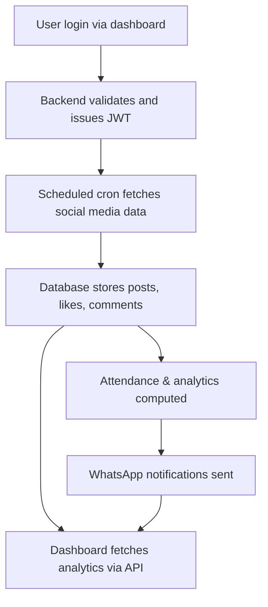

# Cicero Business Process
*Last updated: 2026-02-14*

This document summarizes the high level business processes of the Cicero platform, which consists of two main components: the **Cicero_V2** backend and the **Cicero_Web** dashboard.

## 1. Client & User Management

1. Administrator accesses the dashboard (Cicero_Web) and logs in using their WhatsApp number and `client_id`.
2. Through the dashboard or API endpoints (`/clients`, `/users`), the admin can register new client organizations and add user accounts associated with each client.
3. User data can also be imported in bulk from a Google Sheet using the backend's import service.

## 2. Social Media Data Collection

1. Cron `cronDirRequestFetchSosmed` berjalan terjadwal di zona Asia/Jakarta untuk dua fase: jadwal global (`0,30 6-21 * * *` + final `58 20-21 * * *`) dengan gating per-client: segmen `org/ditbinmas` sampai 20:58 WIB, sedangkan segmen `direktorat` selain ditbinmas sampai 21:58 WIB.
2. Pada setiap run global, sistem selalu refresh likes/komentar; fetch post Instagram/TikTok hanya dieksekusi bila slot Jakarta sesuai segmen client (Segmen A hingga 20:58, Segmen B hingga 21:58).
3. Hasil fetch disimpan ke PostgreSQL, lalu dipakai untuk attendance dan analytics.

## 3. Dashboard Analytics

1. The dashboard queries the backend for analytic summaries (`/dashboard/*`, `/insta/*`, `/tiktok/*`).
2. Clients can view daily engagement data, user directories, and post histories for their social media accounts.
3. Results are normalized by the backend so the dashboard receives consistent JSON structures.

## 4. Notifications & Reporting

1. Notifikasi tugas bersifat **change-driven only**: daftar tugas hanya dikirim saat ada perubahan penting pada data post/link (hasil `hasNotableChanges`) dan tidak ada lagi blast hourly berbasis `last_notified_slot`.
2. Pengiriman log/error operasional tetap melalui WhatsApp admin; `telegramService` dipertahankan sebagai wrapper WA untuk backward compatibility.
3. Admin juga dapat memicu proses manual tertentu dari command WhatsApp (dirrequest).

## 5. Queue Processing

1. For heavy workloads, Cicero_V2 can publish tasks to RabbitMQ queues.
2. Worker processes consume the queues and update the database asynchronously, keeping the dashboard responsive.

## 6. Overall Flow

The business process begins with client onboarding and continues with automated collection of social media metrics, attendance checks, and delivery of reports. Administrators interact mainly through the Next.js dashboard while the backend orchestrates data retrieval, persistence, and messaging tasks.

Refer to [docs/naming_conventions.md](naming_conventions.md) for code style guidelines.

## 7. Source of Truth Operasional

Untuk menghindari salah interpretasi di sisi ops, jadwal cron dan flow notifikasi resmi dipusatkan di:
- [docs/notification_schedule_source_of_truth.md](notification_schedule_source_of_truth.md)

Saat ada perubahan fungsi/modul yang memengaruhi jadwal atau notifikasi, dokumen tersebut harus ikut diperbarui.
